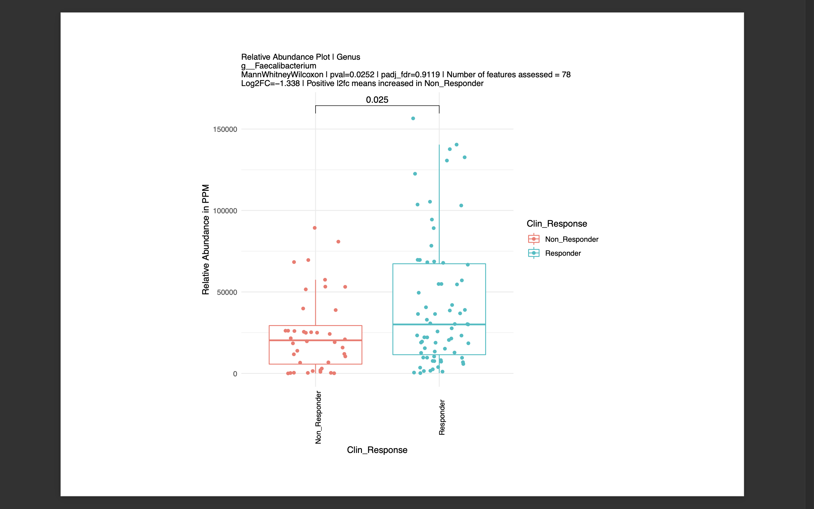

## Analysis of fecal samples obtained from humans


```R
pdf("Fig1B_With_Fprausnitzii_JAMS.pdf", paper = "a4r")

plot_relabund_features(ExpObj = expvec$LKT, glomby = NULL, samplesToKeep = Samples_Validation_have, featuresToKeep = "LKT__s__Faecalibacterium_prausnitzii", aggregatefeatures = FALSE, aggregatefeatures_label = "Sum_of_wanted_features", subsetby = NULL, compareby = "Clin_Response", fillby = "Clin_Response", shapeby = NULL, facetby = NULL, wrap_facet = FALSE, overlay_boxplot = FALSE, applyfilters = "moderate", featcutoff = NULL, GenomeCompletenessCutoff = NULL, PctFromCtgscutoff = NULL, ntop = NULL, minabscorrcoeff = NULL, adjustpval = TRUE, padjmeth = "fdr", showonlypbelow = NULL, showonlypadjusted = FALSE, maxl2fc = NULL, minl2fc = NULL, addtit = NULL, PPM_normalize_to_bases_sequenced = FALSE, uselog = FALSE, statsonlog = FALSE, cdict = cdict, stratify_by_taxlevel = NULL, maxnumplots = NULL, signiflabel = "p.format", max_pairwise_cats = 4, dump_interpro_descriptions_to_plot = FALSE, numthreads = 1, nperm = 99, ignoreunclassified = TRUE, class_to_ignore = "N_A", maxnumtaxa = 20, horizontal = TRUE, plot_points_on_taxonomy = FALSE, use_heatmap_for_stratification = TRUE, return_plots = FALSE, rescale_axis_quantiles = NULL)

dev.off()
```


